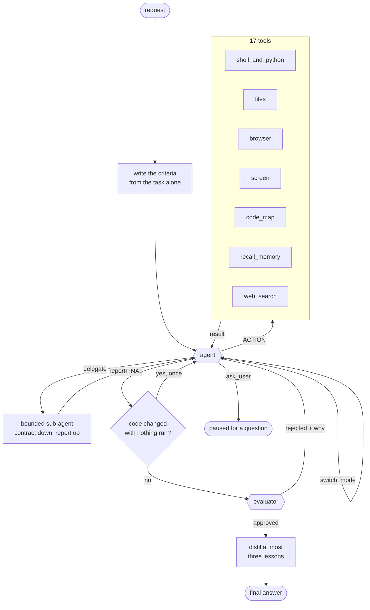

# Otto

can't say much explore on your own

## Architecture

One agent, one evaluator. The agent works the task end to end in a single
conversation -- find out what is true, do the work, confirm it holds -- and
changes MODE when the kind of work changes. A mode is a model and a way of
thinking, not a separate node: switching swaps the model underneath while the
conversation, the tools and everything learned so far carry over.

This replaced a seven-node graph with an overseer that re-decided after every
step. Measured on Claw-Eval traces, the boundaries between those nodes were 45
to 69% of a run's wall time against 0.1 to 0.4 seconds of actual tool
execution per task, and three of every five model calls were overhead. Mean
score went 0.54 to 0.62 on the measured tasks when they collapsed into one.

- **criteria first** -- what a correct answer must contain is written from the
  task *before* any attempt exists, in its own call. This is the only
  information in the whole judgment that the actor did not produce. A verifier
  that re-reads the actor's own output measures at approximately nothing;
  with an external checklist the same models go from around 0% to 90-98%.
- **the agent loop** -- one conversation, a text `ACTION:` / `CODE:` protocol
  rather than JSON tool calls, one tool call per reply. Before a mutating tool
  runs against a target for the first time, it is held once for a check --
  mutating actions are 14-18% of steps and a single mutating mistake cuts
  success odds by 55-96%, so the gate is cheap and precisely aimed.
- **modes** -- solve, plan, summarize, find. Escalating to a deeper mode
  restarts from the task and the criteria; de-escalating carries the whole
  conversation. A stronger model handed a weaker one's trajectory recovers
  less than half the gain at several times the cost, which is why the two
  directions are not symmetrical.
- **delegate** -- one bounded subtask, one level, on a different mode's model.
  A contract goes down and a report comes back; the child's trajectory is
  discarded. Where every agent shares a model, a single agent matches or beats
  the multi-agent version at lower cost, so this earns its keep only when the
  model genuinely differs.
- **the evidence gate** -- an answer that changed code with nothing run since
  is held once and asked for the check. No model call unless it fires, prose
  edits exempt, and "there is nothing to run here" is an accepted answer.
- **the evaluator** -- scores the answer against the criteria written at the
  start, separates "not met" from "blocked by the environment", and may check
  one thing with a tool. Rejection hands straight back to the agent.
- **memory** -- a tiered queue per session. Recent turns verbatim, older ones
  summarised into cited bullets, every raw item kept as an embedded chunk that
  `recall_memory` can search. What the *person* said is never handed to the
  summariser: type-blind compaction loses constraints (3 of 8 at 120 turns,
  0 of 8 at 400), type-aware keeps 8 of 8 at every budget tried.
- **lessons** -- a finished run distils at most three transferable lessons,
  and the next run reads at most one, only when it is relevant. Off in the
  baseline arm of any measurement.
- **routing** -- four vendors behind a task-to-model table, reordered by what
  each seat has actually achieved once twelve runs back it, with one run in
  ten exploring so the order cannot freeze. A rate limit cools one model;
  three transport failures cool the provider.

## Measuring it

| command | what it grades |
| --- | --- |
| `otto eval` | 20 golden code, math and NP-hard tasks, by a real checker |
| `otto eval-swe` | SWE-bench Verified -- 500 real issues, by each repo's own tests |
| `otto eval-claw` | Claw-Eval's 300 tool-use tasks, by their graders |
| `otto eval-memory` | LoCoMo long-conversation recall |
| `otto eval-compaction` | what each compaction policy loses from the prompt |
| `otto eval-hle` | Humanity's Last Exam |

Every model request counts against a spend ceiling, retries included.
`otto eval-claw --trials N` reports pass^k and the spread, because a single
run on that benchmark swings 0.36 between identical attempts, and every report
carries a fingerprint of the grading path -- two numbers from different
fingerprints are not a comparison.
