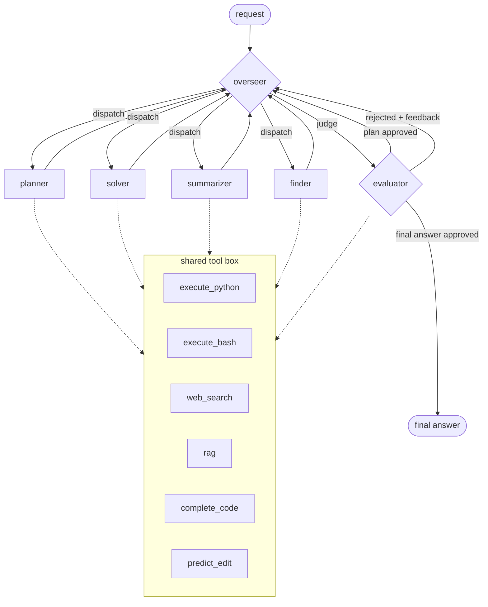

# Otto

can't say much explore on your own

## Architecture

One overseer, four specialists, one evaluator -- but the overseer runs after *every* step, not just once. It reads everything gathered so far (context, an approved plan, a pending output, a rejection) and decides the single next move: dispatch a specialist, or send the pending work to the evaluator. There is no cap on how many times it may retry a task -- the only backstop is a generous recursion limit, pure infra insurance against a runaway loop, never a business rule. Rejections retry the *same* specialist by default (the four don't overlap, so switching isn't just an alternate way to do the same job); the one deliberate exception is a task that was solved without a plan and needed one -- the overseer escalates to the planner instead, and learns which kinds of task in this run actually needed planning.

- **overseer (router)** -- one classification call, no tools, re-invoked after every step. Decides what the task still needs: a lookup (finder), a plan for a task complex enough to want one (planner), a condensed context once it's gotten large (summarizer), a concrete answer (solver), or a judgment on whatever was just produced (evaluator). On a rejection it defaults to retrying the same specialist with the feedback in view, unless the feedback shows the real problem was skipping a plan -- then it escalates to the planner instead.
- **planner / solver / summarizer / finder** -- one specialist runs per dispatch, looping ACTION → tool result → ... → FINAL, then always hands back to the overseer (never straight to the evaluator). finder appends what it gathers onto shared context; summarizer replaces that context with a condensed version; planner and solver leave it alone.
- **evaluator** -- same tool access as the specialists, dual-mode: judges a plan (would it work if followed?) or a candidate final answer (is the task actually done?). Approving a plan hands back to the overseer with work still to do; approving a final answer ends the run; rejecting either goes back to the overseer with the reason, no matter how many rounds have already happened.
- **tools** -- `execute_python` / `execute_bash` (real), `web_search` / `rag` (stubbed), `complete_code` / `predict_edit` (Mercury's FIM/edit endpoints). Read-only: nothing irreversible happens before the evaluator signs off.

Every call routes through Mercury (Inception) via `agent/router` -- it's the only provider wired in.
