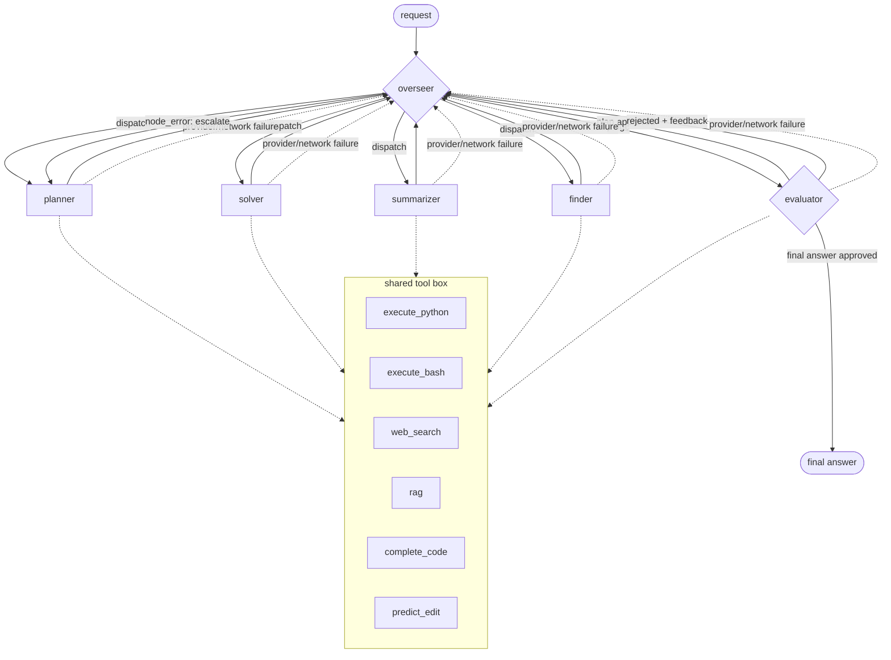

# Otto

can't say much explore on your own

## Architecture

One overseer, four specialists, one evaluator -- but the overseer runs after *every* step, not just once. It reads everything gathered so far (context, an approved plan, a pending output, a rejection) and decides the single next move: dispatch a specialist, or send the pending work to the evaluator. There is no cap on how many times it may retry a task -- the only backstop is a generous recursion limit, pure infra insurance against a runaway loop, never a business rule. Rejections retry the *same* specialist by default (the four don't overlap, so switching isn't just an alternate way to do the same job); the one deliberate exception is a task that was solved without a plan and needed one -- the overseer escalates to the planner instead, and learns which kinds of task in this run actually needed planning.

- **overseer (router)** -- re-invoked after every step. Before any plan exists, or after a rejection, it makes one classification call: a lookup (finder), a plan for a task complex enough to want one (planner), a condensed context once it's gotten large (summarizer), a concrete answer (solver), or a judgment on whatever was just produced (evaluator). On a rejection it defaults to retrying the same specialist with the feedback in view, unless the feedback shows the real problem was skipping a plan -- then it escalates to the planner instead (discarding the old plan, since it turned out to be the problem).
- **plan execution** -- once the evaluator approves a plan, it isn't free text: it's a JSON list of `{task, route_to, output}` steps, `task` written by the planner and `route_to` filled in by the overseer one step at a time. While a plan is executing, the overseer stops asking the open-ended question above -- it deterministically finds the next step with no output yet and makes a *narrower* call (just "which specialist should run this one step"), or, once every step has an output, dispatches straight to the evaluator with no LLM call at all. Each finished step's result is folded into shared context, so later steps build on earlier ones'.
- **planner / solver / summarizer / finder** -- one specialist runs per dispatch, looping ACTION → tool result → ... → FINAL, then always hands back to the overseer (never straight to the evaluator). Outside plan execution: finder appends what it gathers onto shared context, summarizer replaces that context with a condensed version, planner and solver leave it alone. While executing a plan step, every role instead writes its result into that step and always appends to context, regardless of its own usual rule -- a summarizer step mid-plan must not erase earlier steps' results.
- **evaluator** -- same tool access as the specialists, dual-mode: judges a plan (a well-formed, complete list of steps that would work if followed) or a candidate final answer (is the task actually done?). Approving a plan hands the parsed step list back to the overseer; approving a final answer ends the run; rejecting either goes back to the overseer with the reason, no matter how many rounds have already happened.
- **provider/network failures** -- a node's own LLM call can fail outright (a timeout, an outage) rather than just answer badly. Any of the five nodes' call failing returns to the overseer with that fact flagged instead of crashing the run; the overseer escalates straight to the planner, deterministically (no LLM call -- one just failed), discarding any plan that was active. The planner sees the failure and whatever output already existed the same way it would see any other specialist's rejected attempt.
- **tools** -- `execute_python` / `execute_bash` (real), `web_search` / `rag` (stubbed), `complete_code` / `predict_edit` (Mercury's FIM/edit endpoints). Read-only: nothing irreversible happens before the evaluator signs off.

Every call routes through Mercury (Inception) via `agent/router` -- it's the only provider wired in.
