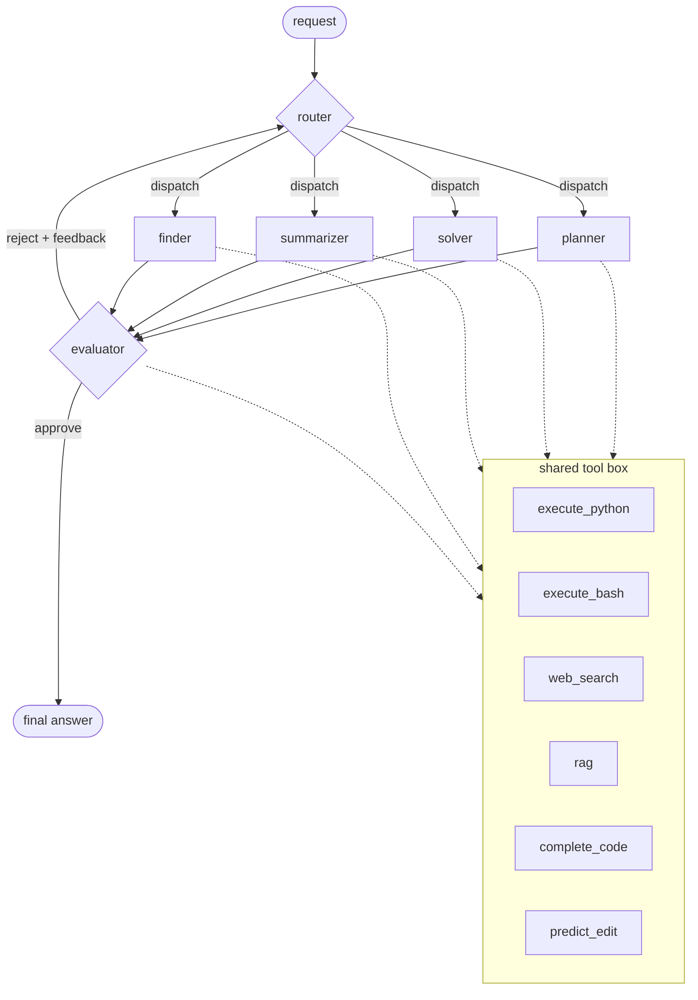

# Otto

can't say much explore on your own

## Architecture

One router, four specialists, one evaluator. No swarm, no vote -- route once, work once, judge once. Reject sends feedback back to the router, not straight back to the same specialist, since the router might pick someone else on retry.

- **router** -- one classification call, no tools. Picks the ideal specialist for the current task; if the evaluator rejects the attempt, the router retries with that feedback -- possibly picking a different specialist, if the feedback suggests the wrong one tried it.
- **planner / solver / summarizer / finder** -- one specialist runs per round, looping ACTION → tool result → ... → FINAL before handing off.
- **evaluator** -- same tool access as the specialists, judges the answer against the original request. Approve ends the run; reject goes back to the router with its reason.
- **tools** -- `execute_python` / `execute_bash` (real), `web_search` / `rag` (stubbed), `complete_code` / `predict_edit` (Mercury's FIM/edit endpoints). Read-only: nothing irreversible happens before the evaluator signs off.

Every call routes through Mercury (Inception) via `agent/router` -- it's the only provider wired in.
