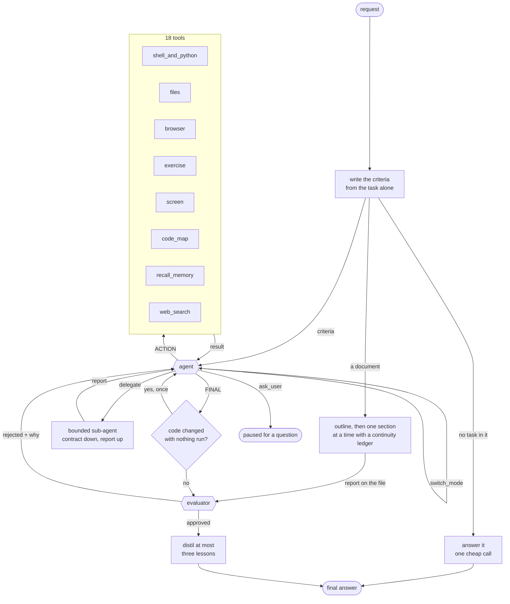

# Otto

[](https://github.com/siddharth23P/otto_agent/actions/workflows/tests.yml)


Otto is a terminal AI agent that works on a codebase, a container, a browser
or a desktop, uses what it built, and judges its own work against criteria it
wrote before it started. It runs as a full-screen TUI or a REPL, routes each
kind of work to the cheapest model that does it well across four vendors,
keeps a tiered memory that makes long sessions feel unbounded, and ships six
benchmark harnesses so every design decision in it is a measurement rather
than an opinion.

Every folder carries its own README describing what is in it and why. This
page is the map. The commit-by-commit record of how the design was arrived at,
with the measurement behind each change, is [docs/HISTORY.md](docs/HISTORY.md).

## What it does, measured

| property | measured |
| --- | --- |
| One agent loop with modes, no node boundaries | a one-tool task costs 3 model calls, a rejection and retry 4; overhead is flat in the length of the work |
| Criteria written from the task before any attempt, shared by the loop and the judge | a write-and-run task is judged in 7 calls and 31 s, approved first time, on five checkable criteria |
| A mutation gate held once before an irreversible action | Claw-Eval T026 (three contacts match, one must be asked about) scores 0.955 with safety 1.0 |
| Type-aware compaction: what the person said is never summarised | 8/8 planted constraints kept at 120 and 400 turns through 23 compaction rounds |
| Two-stage semantic recall over a content-addressed store | LoCoMo recall 96% at about 2,600 tokens per query, store coverage 100% |
| A greeting has no criteria, so it skips the loop | "hi otto!" costs 2 model calls |
| A document is a sectioned workflow, not a loop | a ten-section document of 42,000 words in 54 calls, every section over the asked length |
| `exercise`: the agent uses what it built and the judge reads a code-written report | five runs in a row (a CLI, an API, a curses app among them) walk through what they built before finishing |
| Golden set of 20 code, math and NP-hard tasks with real checkers | 20/20 |
| SWE-bench Verified, graded by each repository's own tests | 2 resolved of 3 soundly graded, with a control run on an untouched repository as part of the harness |

## See it run

An 85-second fullscreen recording of `otto tui`: a request to write and run
a script, the tool trace and the judge as they happen, the answer with its
model and time, the token and dollar ledger, then a greeting answered on the
two-call fast path.

[otto-demo.mov](https://github.com/siddharth23P/otto_agent/releases/download/v0.1.0/otto-demo.mov) (19 MB, from the [v0.1.0 release](https://github.com/siddharth23P/otto_agent/releases/tag/v0.1.0))

## Install

The wheel and sdist are attached to every release:

```bash
pip install https://github.com/siddharth23P/otto_agent/releases/download/v0.1.0/otto_cli_agent-0.1.0-py3-none-any.whl
```

## Quick start

```bash
git clone https://github.com/siddharth23P/otto_agent.git
cd otto_agent
uv sync
```

Put keys in `.env` at the repository root. `INCEPTION_API_KEY` is the one
Otto cannot run without (it alone serves the fill-in-the-middle and edit
endpoints); `OPENAI_API_KEY`, `ANTHROPIC_API_KEY` and `GEMINI_API_KEY` are
optional and each unlocks the seats routed to that vendor. `otto tui` opens
its setup screen on first start when nothing is configured.

```bash
uv run otto doctor      # which providers and seats resolve, and why not
uv run otto tui         # full-screen front end, opens on the current directory
uv run otto chat        # the same pipeline at a prompt
```

| command | what it does |
| --- | --- |
| `otto tui` / `otto chat` | interactive sessions; `--workspace PATH`, `--no-workspace`, `--resume <id\|prefix\|last>` |
| `otto sessions` | list, `--delete`, `--rename`, `--export`, `--import`, `--prune` |
| `otto doctor` | provider and route health, exit 2 on a missing required key |
| `otto models` | every model each configured vendor lists, with detected capabilities |
| `otto route <task>` | the fallback chain for a seat, pins starred, observed outcomes shown |
| `otto lessons` | print, clear, `--export`, `--import` the lesson bank |
| `otto eval` | the golden set |
| `otto eval-swe` | SWE-bench Verified |
| `otto eval-claw` | Claw-Eval (needs a checkout; see [agent/eval/data/claw/README.md](agent/eval/data/claw/README.md)) |
| `otto eval-memory` | LoCoMo recall |
| `otto eval-compaction` | what each compaction policy loses |
| `otto eval-hle` | Humanity's Last Exam, raw model vs. the agent |

Environment variables: `OTTO_MAX_MODEL_CALLS` (per-turn ceiling, default 120),
`OTTO_COMMAND_TIMEOUT` (120 s with a workspace, 10 s without),
`OTTO_EMBEDDING_MODEL` (`provider:model`; local BGE is the floor),
`OTTO_MODEL_PRICES` (a JSON file that overrides the price table),
`OTTO_IGNORE_ROUTES=1` (use the shipped routing table untouched; evals do),
`OTTO_BROWSER_PYTHON` (an interpreter with Playwright and `pyte`, which
enables the browser and terminal tools), `OTTO_NO_ANIMATION=1`, `OTTO_THEME`.

Otto ships no browser. To let it load the pages and terminal programs it
writes, install Playwright and `pyte` into any Python once and point
`OTTO_BROWSER_PYTHON` at it:

```bash
python3 -m venv ~/.otto/browser && ~/.otto/browser/bin/pip install playwright pyte && ~/.otto/browser/bin/playwright install chromium-headless-shell
```

The file tools cannot touch anything outside the workspace root, symlinks and
`..` included, and that is enforced and tested. `execute_bash` cannot be
confined the same way, so run Otto against a repository you have committed.

## How it works

One agent, one evaluator. The agent works the task end to end in a single
conversation and changes mode when the kind of work changes: a mode is a model
and a way of thinking, not a separate node, so switching swaps the model
underneath while the conversation, the tools and everything learned so far
carry over.



The pieces, each documented in its own folder:

| folder | what lives there |
| --- | --- |
| [agent/pipeline](agent/pipeline/README.md) | the agent loop, the evaluator, the 18 tools, modes, the gates, the workspace and container seams, the document workflow |
| [agent/memory](agent/memory/README.md) | the tiered queue, the content-addressed store, recall, embeddings, the lesson bank, sessions |
| [agent/router](agent/router/README.md) | task seats, the routing table, provider adapters, learned ordering, health, pins, temperature policy |
| [agent/cli](agent/cli/README.md) | the TUI, the REPL, sessions, setup, and every `otto` command |
| [agent/eval](agent/eval/README.md) | the six benchmark harnesses, the failure taxonomy, the single-agent control |
| [agent/config](agent/config/README.md) | the one `.env` file Otto reads and writes |
| [containers](containers/README.md) | the throwaway desktop image the screen tools drive |
| [tests](tests/README.md) | 1,534 tests that need no key and no network |
| [docs](docs/README.md) | the development log, the research sources, the memory design |

## Evaluation

Six harnesses, each grading by something outside the model: a checker, a
repository's own tests, a benchmark's own graders, or a planted constraint.
Every report carries the number of model calls beside the score and a
fingerprint of the grading path; a run that measured nothing refuses to print
a number, and a single Claw-Eval run is labelled as not evidence because
identical runs swing by 0.36. Details, results and the rules the harnesses
enforce: [agent/eval/README.md](agent/eval/README.md).

## Testing

1,534 tests pass and 12 skip on macOS, Linux and Windows in under two minutes,
with no API keys and no network. Tests assert on the messages handed to the
model, on the exact inputs that broke real runs, on call counts against the
real compiled graph, and directly on the library behaviours the code relies
on. What is covered and how: [tests/README.md](tests/README.md).

## Research

Each design decision traces to a published finding, listed with the number
that motivated it and where it landed in the code:
[docs/RESEARCH.md](docs/RESEARCH.md).

## Limitations

- The shell is not sandboxed on the host; only the file tools are confined.
- `code_map` covers Python only, by reading `ast`, and refuses other languages by name rather than answering partially.
- `browse` and `browse_act` each drive a fresh page and restore cookies and storage from disk; in-page state that never touches storage does not survive between calls. `exercise` exists for sequences that need it.
- The Android, iOS, Linux and Windows `exercise` drivers are covered by faked commands only; macOS was driven for real (issues #5 to #8).
- Screen grounding is a description plus coordinates; expect look, act, look again.
- Benchmark results are mostly single runs on small samples, and the harnesses say so.
- Inception's Mercury models are absent from the price table on purpose, so a turn on them shows an unpriced marker rather than a guess.

## License

MIT. See [LICENSE](LICENSE).
