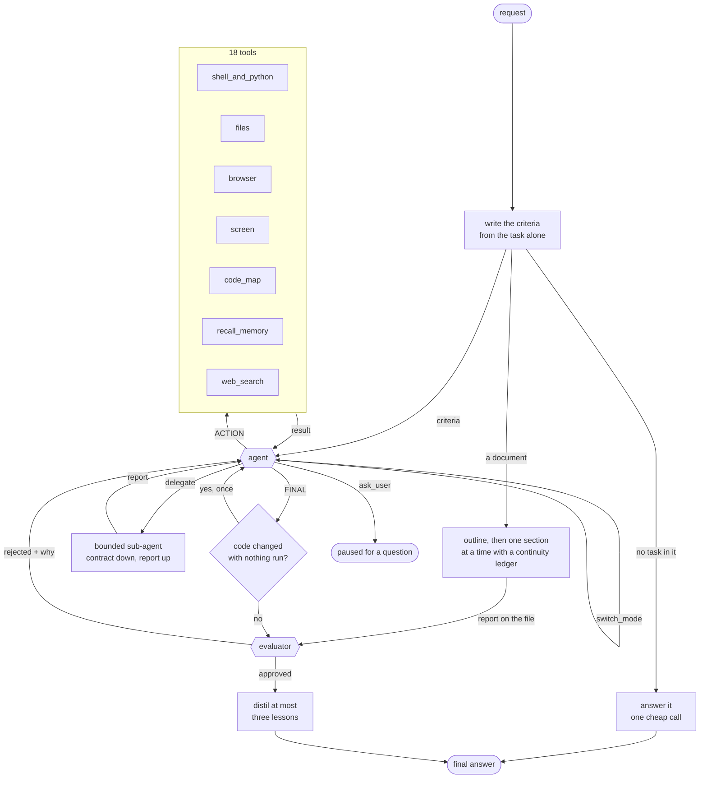

# Otto

can't say much explore on your own

## Running it

```bash
otto tui     # full-screen front end
otto chat    # the same pipeline at a prompt
```

Both open on the directory you launched them in, and otto's file tools work on
it: `read_file`, `write_file`, `edit_file`, `list_files`, `code_map`, plus a
shell and a Python runner whose working directory is that root. Point it
somewhere else with `--workspace PATH`, or hand it no file access at all with
`--no-workspace`. `/workspace` in the REPL and "Workspace…" in the TUI's
command palette (ctrl+p) change it mid-session.

## Letting it see what it built

A run with a workspace and no container had no browser, so a task like "a
playable chess game" was checked the only way it could be: the move logic in
a script, `node --check` on the source. Both passed on a page whose script
threw at load and never drew the board, and the judge, with nothing that
could load a page, approved it. Now `browse open index.html` loads a page
from the workspace in a real headless browser, reports whatever it threw,
and FAILS the call when a page of otto's own throws -- so it is the command
that fails if the page is broken, which is what the evidence gate asks for.
`look <question>` afterwards puts a screenshot of that page in front of the
vision model. A turn that edited a page and tries to finish without loading
it is held once and told to.

Loading is not using. `browse` and `browse_act` each drive a fresh page, so
a selected piece or a half-filled form is gone by the next call. `exercise`
runs a whole sequence -- one step per line -- and its FIRST step says what
kind of thing is being used:

- `open index.html` -- a page in the workspace, in a real browser. Then
  `click New game`, `click css .square:nth-child(53)`, `type Name = otto`,
  `press Enter`, `expect Computer is thinking`, `expect not Checkmate`,
  `count css .piece = 32`, `changed` (the screen differs from before the
  last click, key or typed text -- the honest signal for a canvas game with
  no DOM to count), `wait 300`.
- `serve npm run dev -- --port 5173` then `open http://127.0.0.1:5173/` --
  an app behind a dev server. The server is started for the walkthrough in
  the workspace, waited for, used, and stopped. Loopback is allowed here
  and nowhere else; the same steps as a page follow.
- `run python3 tool.py --count 3` -- a command line. Then `expect 3 items`
  (in what it printed), `exit = 0`, another `run`. A command that exits
  non-zero fails the step unless the next line is `exit = N`, so a
  walkthrough that tests error handling says so and one that does not
  cannot walk past a crash. `serve uvicorn app:app --port 8000` with
  `request GET http://127.0.0.1:8000/health`, `status = 200`, `expect ok`
  does the same for an API; `request POST <url> {"name": "milk"}` sends
  the rest of the line as a JSON body. A page walkthrough may `request`
  its own server too, since an app has both.
- `tty python3 app.py` -- a program in a terminal: a real pseudo-terminal
  of 100 by 30, with `expect Name?` (on screen), `type otto`, `press
  Enter`, `press ctrl+c`, `screen` (put the screen in the report), `exit =
  0`. A Textual or curses app works the same way as a prompt.
- `android com.example.app` (or `android build/app.apk com.example.app`),
  `ios build/Demo.app` (or a bundle id, on the booted simulator), `mac
  ./counter` (a command in the workspace) or `mac Calculator`, `linux
  ./app`, `windows app.exe` -- an app on a device or a desktop. Then
  `click Add one` (by what it says) or `click 120 40` (in the app's own
  window), `type`, `press Enter`, `expect [not] <text>` (what the app
  shows, read through its accessibility tree), `screen`, `changed`,
  `wait`. Each one also watches the app underneath: Android's logcat crash
  lines, an iOS or desktop process that died, its stderr. Android needs adb
  and a running emulator or device; iOS needs a booted simulator and, to
  read or tap the screen, idb; macOS needs Accessibility and Screen
  Recording granted to the terminal running otto; Linux needs xdotool,
  ImageMagick and AT-SPI's Python binding; Windows needs pywinauto in the
  optional interpreter. Each driver addresses only the app it launched,
  never the rest of the desktop.

A turn that changed code and tries to finish having only run its own tests
is held once and asked to `exercise` the thing; "nothing a person runs" is
an accepted answer. Measured before that hold, five runs in a row (a CLI,
an API, a curses app among them) each wrote a harness, passed it, and
finished without using what they built; with it, all five walked through.

Every kind stops at the first step that does not hold and reports each step
as the machine saw it. That report is written by code, so the judge is
shown it under its own heading as the evidence the thing works, and is told
to run one itself when the answer is something a person uses and none was
made. Pages come from the workspace and servers from commands run in it, so
`exercise` never acts on a live site; a desktop app has no local path at
all, for the reason `agent/pipeline/screen.py` gives, and is driven in a
container only.

Otto ships no browser and no terminal emulator. The shell kind needs
nothing. The page and terminal kinds run their drivers through any Python
that can import Playwright and `pyte`: install them once and point
`OTTO_BROWSER_PYTHON` at that interpreter --

```bash
python3 -m venv ~/.otto/browser && ~/.otto/browser/bin/pip install playwright pyte && ~/.otto/browser/bin/playwright install chromium-headless-shell
```

then `OTTO_BROWSER_PYTHON=~/.otto/browser/bin/python` in the environment
or in `.env`. Without it the browser tools are simply not offered, as
before. Loopback and private addresses stay refused for URLs; a workspace
path is the way to open your own page.

## Coming back to a session

Every turn is written to the session's own file as it finishes, so a
conversation survives the process that had it. `otto sessions` lists what
was saved, newest first: a short id, a title (the first thing you said,
until `/rename`), how many turns, which workspace, when. `otto chat --resume
<id>` and `otto tui --resume <id>` pick one up with its history and its
workspace (`last` is the newest; a unique prefix of the id is enough, and an
explicit `--workspace` still wins). Inside either front end, `/sessions`,
`/resume` and `/rename` -- or "Sessions…" and "Rename session…" in the
TUI's palette -- do the same without leaving. A session is saved once a turn
has finished, not when it is opened, so quitting a prompt you never typed
into leaves nothing behind. `otto sessions --delete <id>` forgets one,
`--prune` clears memory files that no session owns and nothing was written
to (every graph run before this left one behind, and the benchmarks still
do).

A session moves between machines as one JSON file: `otto sessions --export
<id> [--to PATH]` writes it (recent turns verbatim, older ones as the
summary they were compacted into, plus the retired text those summaries
cite), and `otto sessions --import PATH` reads it into this machine's
sessions, keeping the id unless one is already here. Embeddings are not in
the file, so `recall_memory` ranks an imported session by recency until it
is re-embedded. The TUI's palette has the whole set: "New session",
"Sessions…" to load one, "Export session…", "Import session…" (which opens
what it read), and "Delete session…", which asks before it forgets.

## Setting it up

`otto tui` opens the setup screen itself the first time it starts with no keys
(or press **f2** / pick "Setup…" from the ctrl+p palette any time). Three tabs:

1. **Providers** -- one row per vendor (`INCEPTION_API_KEY` is the one otto
   cannot run without; `OPENAI_API_KEY`, `ANTHROPIC_API_KEY`, `GEMINI_API_KEY`
   are optional), plus any named OpenAI-compatible endpoint you add -- an
   OpenRouter key, a remote vLLM, Ollama. A name `local` becomes
   `LOCAL_API_KEY` and `LOCAL_BASE_URL`. Keys are written to the repository's
   `.env` (the file otto already loads) and are only ever shown masked.
   "Probe" makes a real call to each and lists what it serves.
2. **Models** -- every model the configured providers list, with the
   capabilities otto believes it has (chat, tools, vision, reasoning, ...).
3. **Mapping** -- for each task seat (`chat_fast`, `reason`, `evaluate`,
   `plan`, `summarize`, `vision`, `web`, `code_complete`, `code_edit`): what
   resolves today, what auto-map proposes and why, and a picker to pin a
   model yourself. Pins go to `~/.otto/routes.json`, sit at the head of the
   shipped fallback chain, and apply to the running session at once.
   `otto route reason` marks a pinned head with a star. "Pin a model for a
   task…" in the palette is the same thing for one seat in two picks.

The routing table in `agent/router/mapping.py` is still the measured default;
`OTTO_IGNORE_ROUTES=1` makes a run use it untouched (evals do). `OTTO_NO_ANIMATION=1`
turns the TUI's motion off without changing what it shows; "Change theme" in the
palette picks any of Textual's built-in themes and `~/.otto/ui.json` remembers it
(`OTTO_THEME` overrides). `ctrl+t` hides the sidebar. Drag to select any text
on screen and `ctrl+c` copies it -- borders and table rules never come along, and
it goes through both OSC 52 and a native command (`pbcopy`, `wl-copy`, `xclip`)
so it works in macOS Terminal.app too. "Export lessons…" /
"Import lessons…" (and `otto lessons --export/--import`) move what otto has
learned between machines as JSON.

What that boundary is worth, stated honestly: the file tools cannot touch
anything outside the root, symlinks and `..` included, and that is enforced
and tested. `execute_bash` cannot be confined the same way -- a shell reaches
whatever you can reach -- so run otto against a repository you have committed.
A command gets 120 seconds when a workspace is open and 10 when it is not;
`OTTO_COMMAND_TIMEOUT` overrides both, and `OTTO_MAX_MODEL_CALLS` caps what a
single turn may spend.

## Architecture

One agent, one evaluator. The agent works the task end to end in a single
conversation -- find out what is true, do the work, confirm it holds -- and
changes MODE when the kind of work changes. A mode is a model and a way of
thinking, not a separate node: switching swaps the model underneath while the
conversation, the tools and everything learned so far carry over.

This replaced a seven-node graph with an overseer that re-decided after every
step. Measured on Claw-Eval traces, the boundaries between those nodes were 45
to 69% of a run's wall time against 0.1 to 0.4 seconds of actual tool
execution per task, and three of every five model calls were overhead. Mean
score went 0.54 to 0.62 on the measured tasks when they collapsed into one.



- **criteria first** -- what a correct answer must contain is written from the
  task *before* any attempt exists, in its own call. This is the only
  information in the whole judgment that the actor did not produce. A verifier
  that re-reads the actor's own output measures at approximately nothing;
  with an external checklist the same models go from around 0% to 90-98%.
- **not every message is a task** -- that same call is also what says so. A
  greeting has no criteria, because it makes no claim to check, and everything
  after it exists to make a claim trustworthy. So it is answered in one further
  call on the cheapest seat: two for the turn, no loop, no judge, no lesson.
  Before this, "hi otto!" cost
  13 model calls and about five minutes -- the loop, told to run something that
  would fail if the task were not done and handed no task, invented one. A real
  task pays nothing for the fast path: the decision falls out of the call that
  was already first.
- **a document is a workflow, not a loop** -- the same rubric call says when
  what is asked for is a long written document, and that goes to
  `agent/pipeline/research.py`: an outline on the plan seat, then one plain
  prose call per section on the reason seat (no tool protocol, so the whole
  reply is the section), each carrying a small JSON ledger of named things
  and settled facts forward so the tenth part can cite a law the first one
  passed. Word counts and required sub-headings are checked in code, a
  failing section is revised once, the sections are assembled into
  `otto_research/<task>/document.md` (and a docx, pdf or xlsx when asked),
  and the evaluator judges a report computed from the files. Asked for ten
  generations with a 500-word narrative each, the loop had answered in 300
  words in 23 seconds and been approved: its prompt asks for "the numbers,
  the names, the decision", its replies stop at the seat's max_tokens, and
  the criteria may not mention length. None of that was the model being lazy.
- **the agent loop** -- one conversation, a text `ACTION:` / `CODE:` protocol
  rather than JSON tool calls, one tool call per reply. Before a mutating tool
  runs against a target for the first time, it is held once for a check --
  mutating actions are 14-18% of steps and a single mutating mistake cuts
  success odds by 55-96%, so the gate is cheap and precisely aimed.
- **modes** -- solve, plan, summarize, find. Escalating to a deeper mode
  restarts from the task and the criteria; de-escalating carries the whole
  conversation. A stronger model handed a weaker one's trajectory recovers
  less than half the gain at several times the cost, which is why the two
  directions are not symmetrical.
- **delegate** -- one bounded subtask, one level, on a different mode's model.
  A contract goes down and a report comes back; the child's trajectory is
  discarded. Where every agent shares a model, a single agent matches or beats
  the multi-agent version at lower cost, so this earns its keep only when the
  model genuinely differs.
- **the evidence gate** -- an answer that changed code with nothing run since
  is held once and asked for the check. No model call unless it fires, prose
  edits exempt, and "there is nothing to run here" is an accepted answer.
- **the evaluator** -- scores the answer against the criteria written at the
  start, separates "not met" from "blocked by the environment", and may check
  one thing with a tool. Rejection hands straight back to the agent.
- **memory** -- a tiered queue per session. Recent turns verbatim, older ones
  summarised into cited bullets, every raw item kept as an embedded chunk that
  `recall_memory` can search. What the *person* said is never handed to the
  summariser: type-blind compaction loses constraints (3 of 8 at 120 turns,
  0 of 8 at 400), type-aware keeps 8 of 8 at every budget tried.
- **lessons** -- a finished run distils at most three transferable lessons,
  and the next run reads at most one, only when it is relevant. Off in the
  baseline arm of any measurement.
- **routing** -- four vendors behind a task-to-model table, reordered by what
  each seat has actually achieved once twelve runs back it, with one run in
  ten exploring so the order cannot freeze. A rate limit cools one model;
  three transport failures cool the provider.

## Measuring it

| command | what it grades |
| --- | --- |
| `otto eval` | 20 golden code, math and NP-hard tasks, by a real checker |
| `otto eval-swe` | SWE-bench Verified -- 500 real issues, by each repo's own tests |
| `otto eval-claw` | Claw-Eval's 300 tool-use tasks, by their graders |
| `otto eval-memory` | LoCoMo long-conversation recall |
| `otto eval-compaction` | what each compaction policy loses from the prompt |
| `otto eval-hle` | Humanity's Last Exam |

Every model request counts against a spend ceiling, retries included.
`otto eval-claw --trials N` reports pass^k and the spread, because a single
run on that benchmark swings 0.36 between identical attempts, and every report
carries a fingerprint of the grading path -- two numbers from different
fingerprints are not a comparison.
