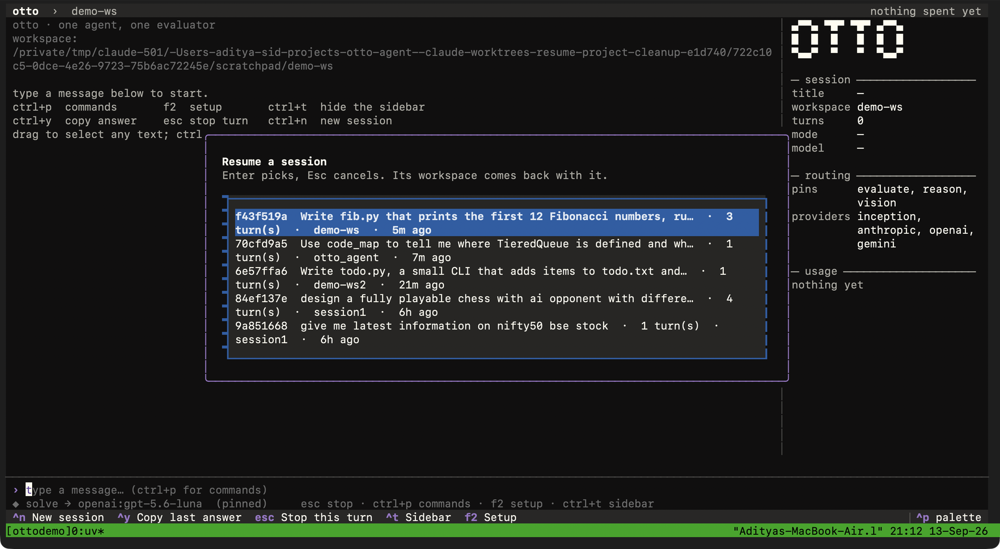

# agent/cli/

The front ends and every `otto` sub-command. `main.py` registers the
commands with Typer and wraps each in `errors.friendly`, so a provider
failure is a one-line message rather than a traceback.

| module | what it is |
| --- | --- |
| `main.py` | the `otto` entry point; loads `.env`, applies routing pins, registers the commands below |
| `tui.py` | the full-screen Textual front end: `otto tui` |
| `chat.py` | the REPL: `otto chat` |
| `shell.py` | what both front ends share: the `Session` (history queue, workspace, usage ledger), slash commands, completion, workspace resolution |
| `setup_screen.py` | the setup wizard: providers and keys, the models they serve, per-seat pins with an auto-map proposal |
| `modals.py` | the TUI's modal screens: ask-user, workspace picker, sessions, score, confirmations |
| `usage_panel.py` | the token and dollar panel down the right of the TUI |
| `art.py` | animation frame tables for the TUI; data, not widgets |
| `clipboard.py` | copying out of the TUI through OSC 52 and a native command at once, so macOS Terminal.app works |
| `output.py` | where a turn's final answer lands on disk |
| `progress` (in `agent/pipeline`) | the status line both front ends watch |
| `sessions.py` | `otto sessions`: list, delete, rename, export, import, prune |
| `lessons.py` | `otto lessons`: print, clear, export, import the lesson bank |
| `doctor.py` | `otto doctor`: provider and route health |
| `models.py` | `otto models`: every model each configured vendor lists |
| `route.py` | `otto route <task>`: a seat's chain, pins and observed outcomes |
| `eval*.py` | `otto eval`, `eval-swe`, `eval-claw`, `eval-memory`, `eval-compaction`, `eval-hle` |
| `context.py`, `errors.py`, `ui.py` | the Typer context, error translation, Rich consoles and theme |

## The TUI

- **Setup** (`f2`, or automatic when no key is configured): one row per
  vendor plus any named OpenAI-compatible endpoint (an OpenRouter key, a
  remote vLLM, Ollama); keys are written masked to the repository's `.env`;
  "Probe" makes a real call to each and lists what it serves. A Models tab
  shows every detected model with its capabilities. A Mapping tab shows, per
  seat, what resolves, what auto-map proposes and why, and a picker to pin a
  model; pins go to `~/.otto/routes.json` and apply to the running session
  at once.
- **Workspace**: opens on the directory `otto` was launched in; a directory
  browser in the palette changes it between turns. `Session.reset()` keeps
  the workspace, because clearing the chat is not changing project.
- **Progress**: a status line with the phase, tool, model, call count and a
  ticking clock; the answer streams in as it is written; escape stops a turn
  within one model call. The thinking block runs open and folds shut when the
  turn ends, labelled with its step count.
- **Usage**: tokens and dollars per model, cumulative for the session, cache
  reads priced separately from input; "--" for a model that reported nothing
  or has no rate, never 0. `ctrl+t` hides the panel.
- **Sessions**: every turn is written to the session's own file as it
  finishes. "Sessions…", "Rename session…", "Export session…", "Import
  session…" and "Delete session…" (with a confirmation) in the palette.
- **One turn at a time**: a second Enter while a turn runs is refused, the
  message box is disabled for the duration, and a modal's Enter never
  escapes into a new turn.
- Themes (any of Textual's, remembered in `~/.otto/ui.json`), drag-to-select
  and `ctrl+c` copy with no borders or table rules, motion gated by
  `OTTO_NO_ANIMATION=1` and off when headless.

## The REPL

The same pipeline at a prompt. Slash commands: `/new`, `/workspace`,
`/sessions`, `/resume`, `/rename`, `/good`, `/bad`, and the rest listed by
`/help`. An `ask_user` pause prompts inline with numbered choices or free
text.

## Both

`resolve_workspace()` in `shell.py` is the one place the workspace policy is
written: the current directory by default, `--workspace PATH` to point
elsewhere, `--no-workspace` for no file access, and `--no-workspace` wins over
`--workspace` because resolving a contradiction towards less access is the
only direction that cannot surprise anyone. `--resume <id|prefix|last>` on
either front end replays a saved session's recent turns and compacted summary
and restores its workspace unless a workspace flag was given explicitly.
