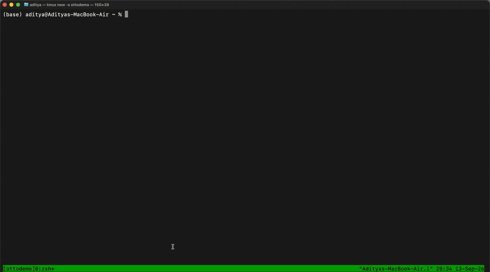
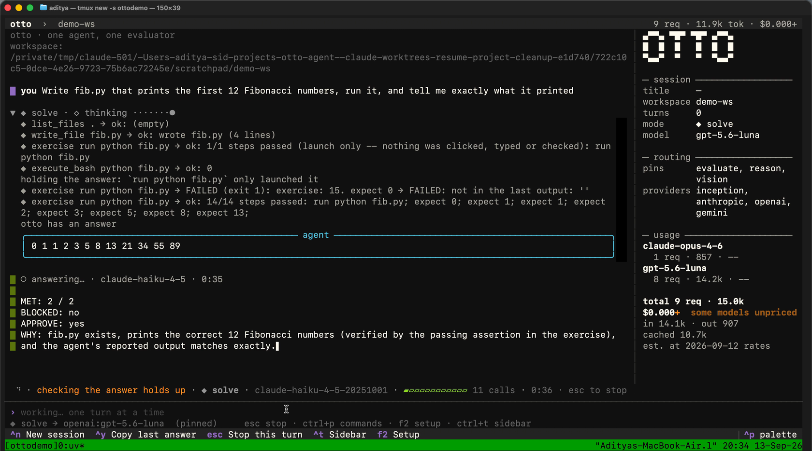
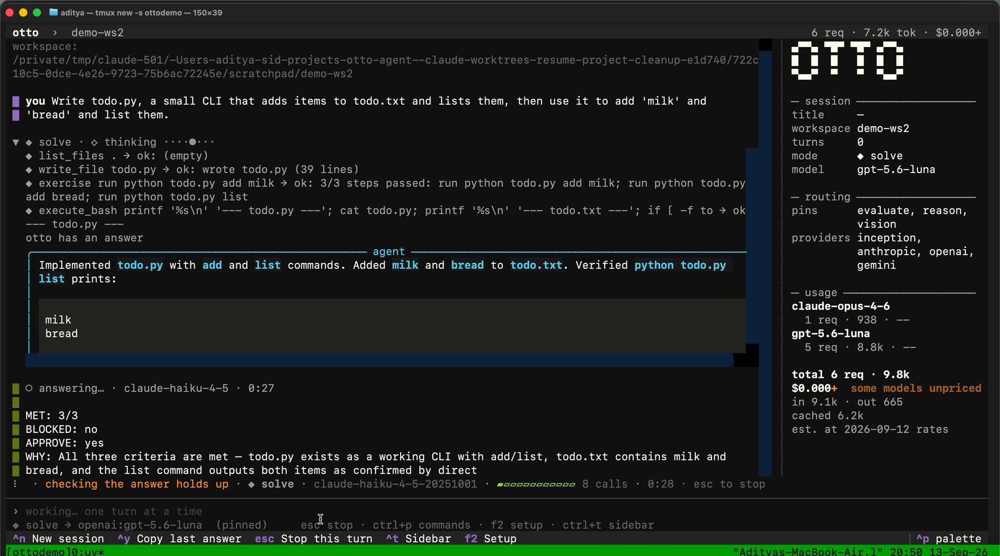
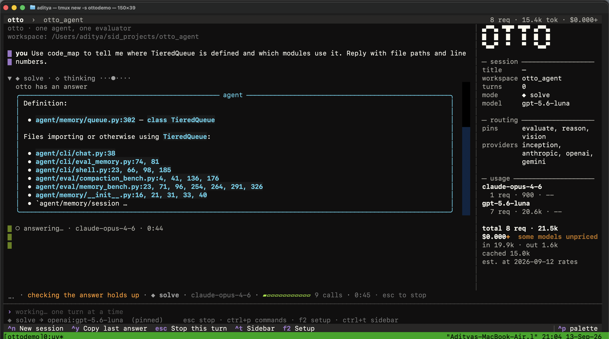
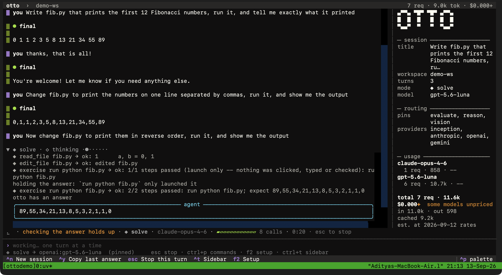
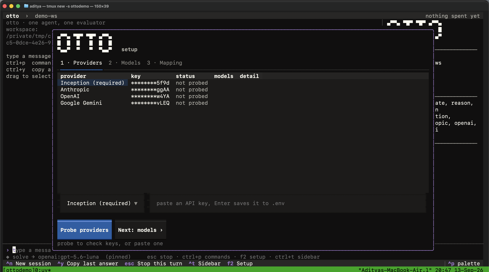

# Otto

A terminal AI agent that works on a codebase, a container, a browser or a
desktop, uses what it built, and judges its own work against criteria it
wrote before it started. One agent loop with modes over four model vendors,
a rubric-first evaluator, tiered memory, six benchmark harnesses, and 1,552
tests that need no API key.

[Source on GitHub](https://github.com/siddharth23P/otto_agent) ·
[Latest release](https://github.com/siddharth23P/otto_agent/releases/latest) ·
[Watch it run (mp4)](https://github.com/siddharth23P/otto_agent/releases/download/v0.1.0/otto-demo.mp4)



## Install

```bash
pip install otto-cli-agent
otto doctor
otto tui
```

`INCEPTION_API_KEY` is required; OpenAI, Anthropic and Gemini keys are
optional and each unlocks the seats routed to that vendor. `otto tui` opens
its setup screen on first start when nothing is configured.

## What it does, measured

| property | measured |
| --- | --- |
| One agent loop with modes, no node boundaries | a one-tool task costs 3 model calls; overhead is flat in the length of the work |
| Criteria written from the task before any attempt, shared by the loop and the judge | a write-and-run task judged in 7 calls and 31 s, approved first time |
| A mutation gate held once before an irreversible action | Claw-Eval T026 scores 0.955 with safety 1.0 |
| Type-aware compaction: what the person said is never summarised | 8/8 planted constraints kept at 120 and 400 turns |
| Two-stage semantic recall over a content-addressed store | LoCoMo recall 96% at about 2,600 tokens per query |
| A greeting has no criteria, so it skips the loop | "hi otto!" costs 2 model calls |
| `exercise`: the agent uses what it built and the judge reads a code-written report | five of five runs walk through what they built before finishing |
| Golden set of 20 code, math and NP-hard tasks with real checkers | 20/20 |

## Screenshots

Each one is a real run, captured while the thinking block was open.











## Read more

- [How it works, folder by folder](https://github.com/siddharth23P/otto_agent#readme)
- [The development log: every commit and the measurement behind it](HISTORY.md)
- [The research each design decision draws on](RESEARCH.md)
- [The memory design and its measurements](design/tiered-memory.md)

MIT licensed. Built by [Siddharth Priyadarshi](https://github.com/siddharth23P).
